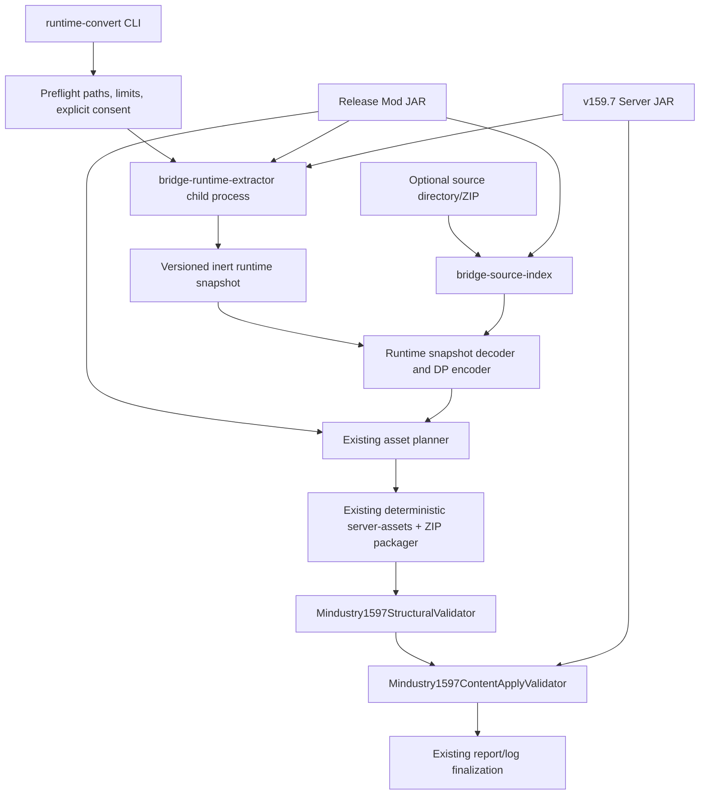

# Local runtime conversion: minimal CLI integration architecture

Last reviewed: 2026-08-01

## Decision

Keep the existing safe `convert INPUT` command unchanged and add a separate, explicitly dangerous
local command. Do not make runtime execution an implicit fallback: users and callers must be able to
tell from the command line whether Mod bytecode will run.

```powershell
dpbridge runtime-convert `
  --server-jar "C:\path\to\server-release.jar" `
  --mod-jar "C:\path\to\trusted-mod.jar" `
  --source "C:\path\to\source-directory-or.zip" `
  --allow-mod-execution `
  --runtime-timeout 120 `
  --server-timeout 60 `
  -o ".\out\trusted-mod"
```

Required:

- `--server-jar`: the v159.7/B480 runtime used both to load the source Mod and to validate the
  generated DP;
- `--mod-jar`: the built release JAR. This is the authority for registered Content and assets;
- `--allow-mod-execution`: mandatory acknowledgement that the Mod receives the current user's JVM
  permissions.

Optional:

- `--source`: source directory or ZIP used only for class/line/asset provenance;
- `--mod-id`: override when `mod.hjson` detection is ambiguous;
- `--runtime-timeout`: source-Mod extraction timeout;
- `--server-timeout`: each existing v159.7 discovery/apply validation timeout;
- existing output, overwrite, and archive limit options.

Do not add a second positional `INPUT` interpretation to `convert`: its current input may be a
directory, ZIP/JAR, CP, or DP, while runtime conversion requires three inputs with different trust
roles. A separate command also prevents Web/automation callers from accidentally enabling code
execution.

## Pipeline



The CLI must launch the extractor as a child process and stream its combined output to both
`conversion.log` and `logs/runtime-extractor.log`. The extractor already creates a second isolated
Mindustry worker process. For the first integration, invoking its main class from the CLI
distribution classpath is less invasive than loading Mod classes into the CLI process. A later
public runner API may remove the extra launcher process, but must retain the child Mindustry JVM.

The current runtime snapshot schema version 1 contains registry identity only. It is useful for
inventory validation but **must not be accepted as sufficient conversion input**. `runtime-convert`
should initially reject it with a structured `RUNTIME_SNAPSHOT_SCHEMA_UNSUPPORTED` diagnostic until
the extractor emits the versioned neutral field/object IR required by
`docs/DYNAMIC_RUNTIME_EXTRACTION.md`.

## Converter integration without duplicating asset logic

Do not expose or copy `DeterministicPackager` into the CLI/runtime extractor. Add a second inert-input
entry point to `BridgeConverter` after the runtime snapshot has been produced:

```kotlin
BridgeConverter.convertRuntimePrepared(
    request = ConversionRequest(input = modJar, ...),
    runtime = RuntimePreparedConversion(...),
)
```

`RuntimePreparedConversion` should contain generated target-relative HJSON, per-content results,
diagnostics, metadata, and provenance paths into the Mod JAR. `BridgeConverter` still performs no
code execution; it only consumes the already-written snapshot.

Internally this entry point should reuse the existing flow:

1. `SafeSourceReader` reads the release JAR with normal archive limits;
2. `SourceDetector` obtains the Mod namespace;
3. runtime-generated HJSON is adapted to the same internal generated-file aggregate currently fed
   to `ConversionPlanner`;
4. the existing planner performs namespace rewriting, asset path selection, collision handling,
   sprite/audio/bundle handling, reference checks, and offline sprite generation;
5. `DeterministicPackager` writes both `server-assets/` and the deterministic DP ZIP.

This is preferable to a second runtime-specific packager because New Horizon's JAR has flattened
runtime asset roots (`sprites/`, `sounds/`, `bundles/`), which the existing Mod planning path already
understands.

Runtime mode must skip ServiceLoader static exporters. JAR runtime state is authoritative; static
AST output must not be merged as a second source of Content.

### File provenance and hybrid Mods

Every runtime-generated content file should refer to a real JAR entry:

- first choice: the class entry identified by runtime class/registration stack;
- second choice: the original declarative `content/` entry when registration came from data;
- last-resort fallback: the Mod descriptor, accompanied by a provenance warning.

Create file-level outcomes for all JAR `.class` entries so the existing
`MOD_CODE_NOT_EXECUTED` diagnostic is not emitted after code was intentionally executed. Classes
that directly registered gameplay Content list their generated output paths; helper/UI/runtime
classes receive an explicit no-direct-output/excluded result.

For hybrid Mods, mark original declarative `content/` files as replaced by the authoritative
runtime snapshot so the planner does not also emit duplicate declarations. Preserve `patches/`:
runtime ownership snapshots do not fully represent mutations to vanilla Content, and the real
DataPatcher validator remains the authority for those patch files.

## Optional source handling

After successful extraction, call:

```kotlin
JarSourceIndexer().index(modJar, source)
```

The source input never supplies output bytes. It only:

- resolves runtime classes/registration frames to repository paths and line numbers;
- reports stale or ambiguous source matches;
- proves whether repository assets equal JAR assets by relative path plus SHA-256.

The release JAR remains authoritative when source differs. For a source ZIP with one GitHub-style
outer directory, the source index ignores that outer directory through package metadata and locates
the `assets` path segment before comparing JAR-relative paths.

## Validation reuse

After packaging, run the same validators as the static command:

1. `Mindustry1597StructuralValidator.validate(dpZip)`;
2. optionally retain `Mindustry1597ServerValidator` for cold-start discovery diagnostics;
3. **mandatory for runtime conversion:**
   `Mindustry1597ContentApplyValidator.validate(serverAssets, serverJar, timeout)`.

The apply validator does not load the source Mod. It proves that the generated DP alone can be read
and applied by the supplied v159.7 DataManager/DataPatcher. Any apply failure makes the final result
`REJECTED`. `SERVER_LOAD` and `MAP_IMPORT` remain `NOT_RUN` until a map/save carrying the generated
DP is actually loaded.

Move the existing validation/report-merging block out of `ConvertCommand.call()` into a CLI-local
`Mindustry1597ValidationRunner`. Both commands can then share log files, stage merging, diagnostic
deduplication, metadata, and exit-code behavior without changing the validators themselves.

## Report and logs

The first integration does not require a `bridge-model` schema break. Use existing
`ContentResult`, `FileResult`, `Diagnostic`, `ValidationStage.RUNTIME`, and `OutputArtifactKind.OTHER`.
Add stable metadata keys for:

- source Mod JAR/server JAR paths and SHA-256;
- runtime snapshot schema/path/hash and registered counts;
- extractor exit code, timeout, and logs;
- source-index class and asset match counts;
- generated, degraded, dropped, and excluded runtime contents;
- DataPatcher apply counts and result.

Recommended retained files:

```text
logs/conversion.log
logs/runtime-extractor.log
logs/runtime-work/.../headless.log
logs/runtime-work/.../registration-traces.tsv
runtime-snapshot.json
source-index-report.json          # only when --source is supplied
logs/server-asset-discovery.log
logs/data-patch-apply.log
report.json
report.md
```

The combined `RUNTIME` validation stage passes only when source extraction completed, the expected
target Mod was identified, the server version is exactly build 159 revision 7, and generated assets
passed the real apply validator.

## File-level implementation order

1. **Freeze the runtime snapshot contract** in `bridge-runtime-extractor` documentation/tests.
   Keep schema v1 inventory-only; introduce a new schema version for field/object IR.
2. **`bridge-converter`**: add `RuntimePreparedConversion.kt` and a tested
   `BridgeConverter.convertRuntimePrepared` entry point; refactor only the common conversion body.
   Reuse `ConversionPlanner` and `DeterministicPackager` rather than adding another writer.
3. **`bridge-converter` tests**: use inert, self-authored runtime snapshot fixtures to prove class
   claiming, hybrid-content replacement, asset reuse, collision handling, and deterministic ZIPs.
4. **`bridge-cli`**: add `RuntimeConvertCommand.kt` and register it beside `ConvertCommand`.
5. **`bridge-cli`**: add `RuntimeExtractorProcess.kt`; depend on
   `bridge-runtime-extractor` and `bridge-source-index`, pass explicit output/work paths, stream logs,
   enforce timeouts, and terminate the child process tree on cancellation.
6. **`bridge-cli`**: extract the existing lines 114-255 validation/report logic from `Main.kt` into
   `Mindustry1597ValidationRunner.kt`, then call it from both commands.
7. **`bridge-model`**: make no mandatory first-pass change. Add field-level result models only when
   the runtime IR exporter needs structured per-field reporting rather than encoding it in
   diagnostics/metadata.
8. **`bridge-target-1597`**: keep `Mindustry1597ContentApplyValidator` unchanged initially; add new
   target code only if the runtime IR encoder needs a reusable v159.7 schema/ClassMap service.
9. Run normal unit tests, a self-authored executable fixture, then the opt-in New Horizon end-to-end
   test. Never make third-party Mod execution part of the default test task.

This sequence produces an early CLI shell without weakening the static command, while postponing
actual DP claims until the runtime snapshot contains enough data to encode and validate content.
